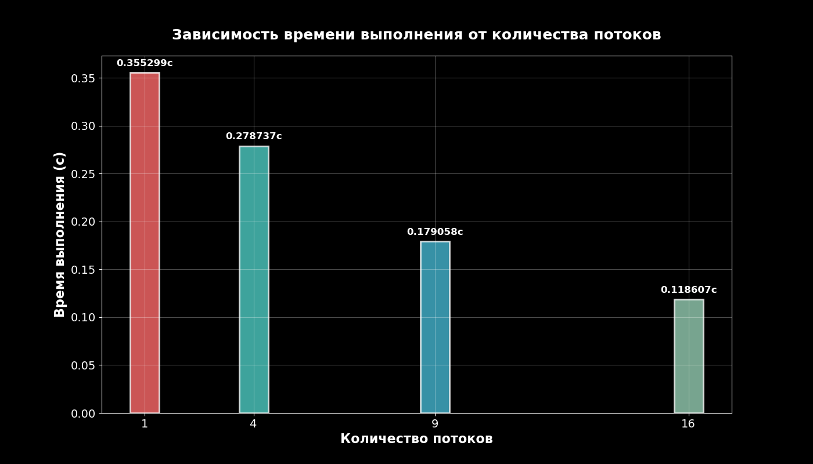

# Параллельное вычисление определённого интеграла методом Монте-Карло
--- 

## Характеристики вычислительного устройства (Linux Manjaro)
```
Architecture:                x86_64
  CPU op-mode(s):            32-bit, 64-bit
  Address sizes:             39 bits physical, 48 bits virtual
  Byte Order:                Little Endian
CPU(s):                      12
  On-line CPU(s) list:       0-11
Vendor ID:                   GenuineIntel
  Model name:                12th Gen Intel(R) Core(TM) i5-12450H
    CPU family:              6
    Model:                   154
    Thread(s) per core:      2
    Core(s) per socket:      8
    Socket(s):               1
```  

В эксперименте методом Монте-Карло вычисляется определённый интеграл от функции   

$$f(x) = e^x, \quad x \in [0, 1]$$

Вычисления проводились параллельно в `n` потоков с использованием разделяемой памяти.  
Время работы замерялось при различном числе потоков.  

## График результатов
На рисунке приведена зависимость времени вычислений от числа потоков:  



